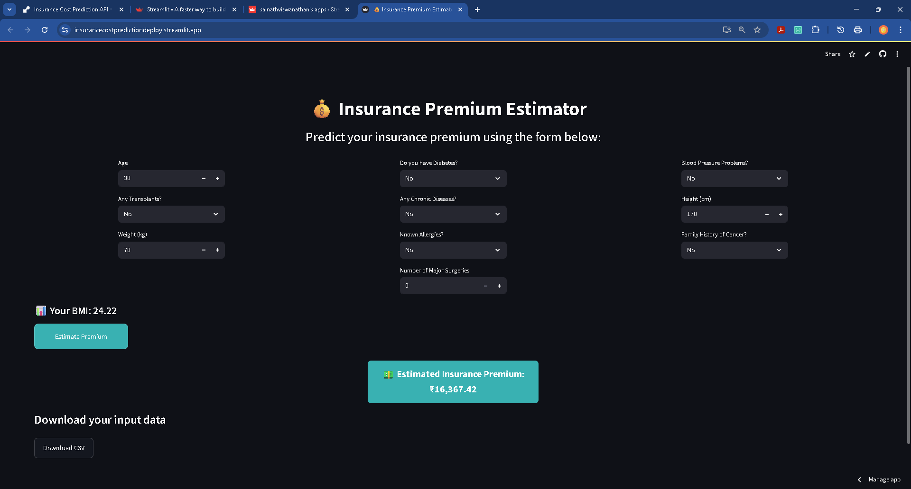

# 📊 Insurance Cost Prediction (Portfolio Project)

## 📌 Problem Statement

Accurately predicting health insurance costs is a major challenge for insurers. Traditional actuarial methods often rely on broad averages, missing the impact of **individual risk factors**. This leads to premium mispricing, financial risks, and customer dissatisfaction.

This project leverages **machine learning** to predict insurance premiums using demographic, lifestyle, and medical attributes, enabling more **fair, personalized, and precise pricing**.

---

## 🎯 Aim & Objectives

**Aim** → Build and deploy a predictive model for insurance premiums, improving risk assessment and insurer competitiveness.

**Objectives**:

1. Perform **EDA & Hypothesis Testing** to identify key predictors.
2. Implement & compare multiple ML models (Linear, Tree-based, Boosting, Neural Nets).
3. Evaluate models on **R², RMSE, MAE** with cross-validation.
4. Apply **SHAP & feature importance** for explainability.
5. Visualize key insights via **Tableau dashboards**.
6. Deploy best model using **Flask/Streamlit**.
7. Provide **business recommendations** for fairer underwriting.

---

## 📂 Dataset Overview

**Records:** 986 | **Features:** 11

### Features

* **Demographic & Lifestyle**: `Age`, `Height`, `Weight`, `BMI` (engineered), `BMI_Category`, `Age_Group`
* **Medical Risk Factors (Binary)**:

  * `Diabetes`
  * `Blood_Pressure_Problems`
  * `Any_Transplants`
  * `Any_Chronic_Diseases`
  * `Known_Allergies`
  * `History_of_Cancer_in_Family`
  * `Number_of_Major_Surgeries`

**Target Variable:** `Premium_Price` (₹15,000 – ₹40,000)

---

## 🔎 Exploratory Data Analysis

* **Age** → Strongest predictor (Corr = 0.70). Premiums rise from ₹16k (18–29) to ₹29k+ (60+).
* **Transplants** → +32% higher premiums, strongest medical risk driver.
* **Chronic Diseases** → +14% higher premiums.
* **Major Surgeries** → More surgeries → consistently higher costs.
* **Diabetes & BP** → High prevalence (42% & 47%), push risk pool upward.
* **Genetic/Lifestyle factors**:

  * Family cancer history (\~12%) → moderate impact.
  * BMI/Weight → weak standalone predictors, stronger when combined with comorbidities.
  * Allergies & height → negligible influence.

---

## 🏗️ Modeling Approach

### Models Compared

* Linear Regression, Decision Tree, Random Forest, Gradient Boosting, XGBoost, LightGBM, Neural Network

### Results

| Model                            | Train R² | Test R²  | Test RMSE | Verdict        |
| -------------------------------- | -------- | -------- | --------- | -------------- |
| Linear Regression                | 0.70     | 0.79     | 3020      | Weak baseline  |
| Decision Tree (Tuned)            | 0.83     | 0.88     | 2220      | Good, unstable |
| **Random Forest (RandomSearch)** | **0.82** | **0.89** | **2129**  | 🥇 Best        |
| Gradient Boosting                | 0.85     | 0.88     | 2279      | Strong         |
| LightGBM                         | 0.87     | 0.88     | 2239      | 🥈 Runner-up   |
| XGBoost                          | 1.00     | 0.86     | 2457      | ❌ Overfit      |
| Neural Network                   | 0.70     | 0.78     | 3085      | ❌ Weak         |

✅ **Final Choice** → **Random Forest** (best balance of accuracy & generalization)

---

## 📊 Feature Importance (Random Forest)

Top drivers influencing `Premium_Price`:

1. **Age** (dominant, 70% correlation)
2. **Any\_Transplants**
3. **Number\_of\_Major\_Surgeries**
4. **Any\_Chronic\_Diseases**
5. **Blood\_Pressure\_Problems**
6. **Weight & BMI** (amplify chronic risks)
7. **Family Cancer History** (incremental risk)

SHAP confirmed → **Age + medical history dominate**, while lifestyle factors are secondary.

---

## ✅ Final Results

* **Model Deployed:** Random Forest Regressor
* **Performance:**

  * Test R² = **0.89**
  * Test RMSE = **₹2,129**
  * Test MAE = **₹1,189**

---

## 📖 Business Insights

1. **Age-Based Risk** → Premiums must scale steeply by age bands.
2. **Critical Events Drive Costs** → Transplants, chronic conditions, surgeries = largest premium escalators.
3. **Chronic Risk Pool** → High diabetes & hypertension prevalence create a costly mid-risk group.
4. **Lifestyle Factors** → Use BMI/weight only when combined with chronic indicators.
5. **Two Risk Profiles**:

   * Low/Moderate (₹15k–25k): Young & healthy.
   * High-Cost (>₹30k): Older, transplant/surgery cases.
6. **Outliers = Real Risks** → Must retain high-BMI & transplant cases as true cost-drivers.

---

## ✅ Recommendations

1. **Dynamic Age-Banding** for fairer premiums.
2. **Stronger premium loadings** for transplant history, comorbidities, and surgeries.
3. **Cluster-Based Underwriting** → Fast segmentation into low vs. critical risk groups.
4. **Lifestyle as Add-ons** (BMI, weight refinements only with comorbidities).
5. **Monitor Model Drift Quarterly** to ensure fairness across groups.
6. **Product Strategy** → Wellness plans for young adults; high-premium covers for chronic/critical cases.

---

## 🚀 Deployment & Deliverables

* **Jupyter Notebook** → EDA, hypothesis testing, ML modeling, insights.
* **Flask API + Streamlit App** → Real-time premium prediction.
* **Tableau Dashboard** → Visualization of health-risk patterns.
* **Technical Blog (2000 words)** → Walkthrough of approach, insights, deployment.
* **Demo Video (5 min)** → EDA, model explanation, deployed app demo.

---

## 📊 Demo & Links

* Tableau Dashboard: \[🔗 Add link]
* Deployed App: \[🔗 Add link]
* GitHub Repo: \[🔗 This repo]
* Blog (Medium/TDS): \[🔗 Add link]
* Loom Video: \[🔗 Add link]
* Portfolio Page (Optional): \[🔗 Add link]

---

## 👨‍💻 Author

**Sainath Viswanathan**

* 📧 [Email](mailto:sainath.sushil@gmail.com)
* 🔗 [LinkedIn](linkedin.com/in/sainathviswanathan) | [GitHub](https://github.com/SainathViswanathan)] | [Portfolio]

## 👨‍💻 Author  

**Sainath Viswanathan**  
* 📧 [sainath.viswanathan28@gmail.com](mailto:sainath.viswanathan28@gmail.com)  
* 🔗 [LinkedIn](https://www.linkedin.com/in/sainath-viswanathan) | [GitHub](https://github.com/SainathViswanathan) | [Portfolio](https://www.datascienceportfol.io/sainath-viswanathan)
